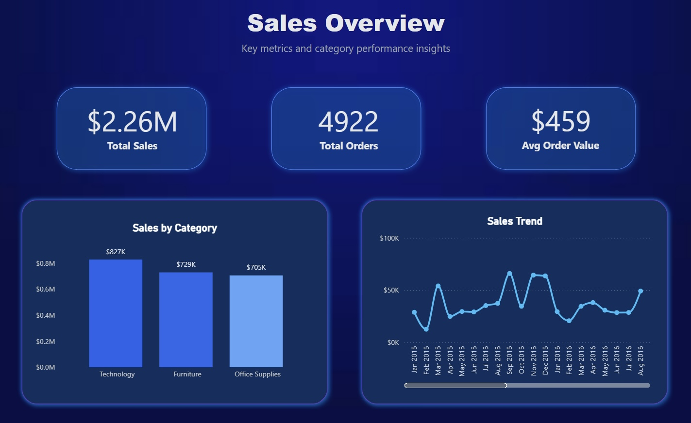
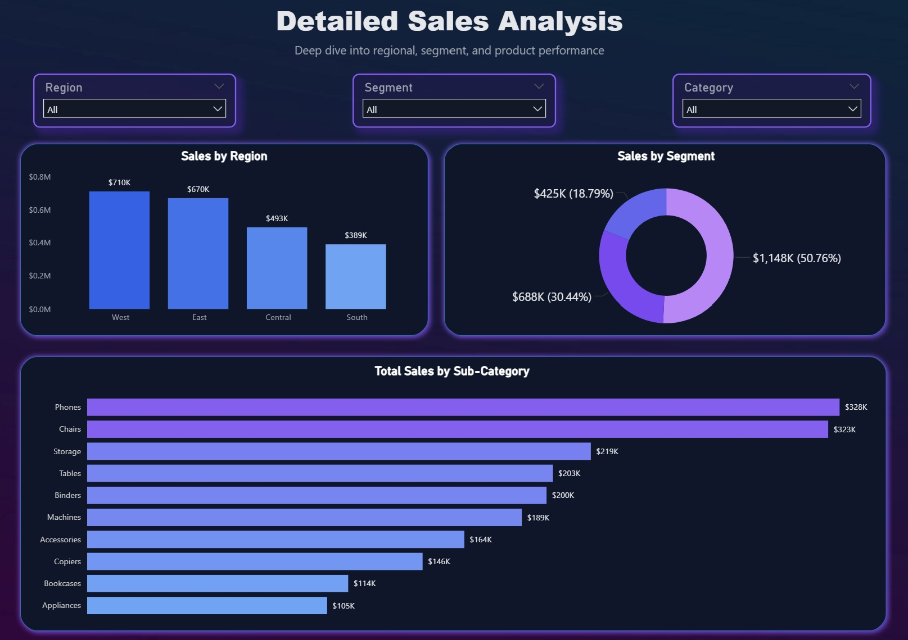
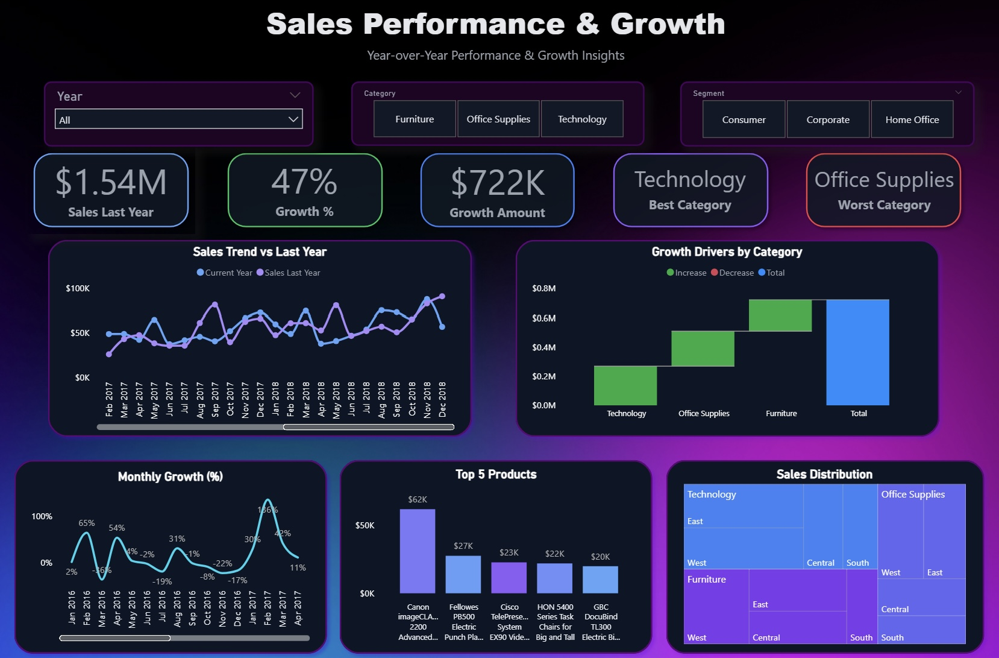

# 📊 Power BI Dashboard Portfolio – Sales Analysis

This project showcases a complete Power BI dashboard solution designed to analyze sales performance, growth trends, and business insights using interactive visualizations.

---

## 🎯 Project Objective
The goal of this project is to transform raw sales data into actionable insights by building clear, interactive dashboards that support data-driven decision-making.

---

## 🥉 Bronze Dashboard – Sales Overview
Focus: High-level performance metrics

- Total Sales, Total Orders, Average Order Value  
- Sales by Category  
- Monthly Sales Trend  

---

## 🥈 Silver Dashboard – Detailed Analysis
Focus: Deeper segmentation and breakdown

- Sales by Region  
- Sales by Segment  
- Category and filter-based analysis  

---

## 🥇 Gold Dashboard – Performance & Growth
Focus: Advanced analytics and insights

- Year-over-Year Growth Analysis  
- Growth % and Growth Amount  
- Best & Worst Performing Categories  
- Growth Drivers by Category  

---

## 🛠️ Tools & Technologies
- Power BI  
- Data Modeling  
- Data Visualization  

---

## 📈 Key Insights
- Technology is the top-performing category across all dashboards  
- Significant year-over-year growth observed  
- Regional and segment performance varies, highlighting key business opportunities  

---

## 📎 Project Link
GitHub Repository: https://github.com/ananoedzgveradze/powerbi-dashboard
